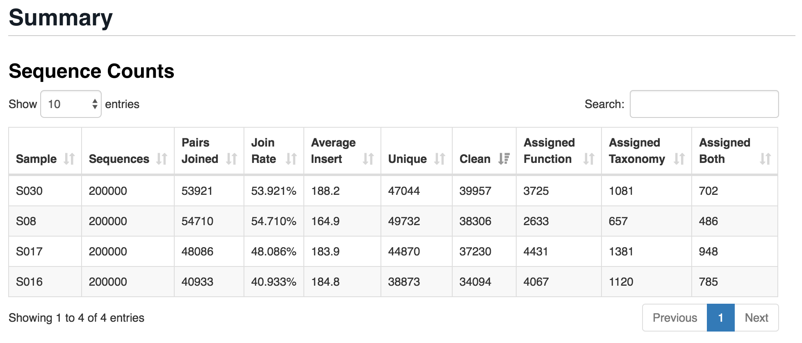
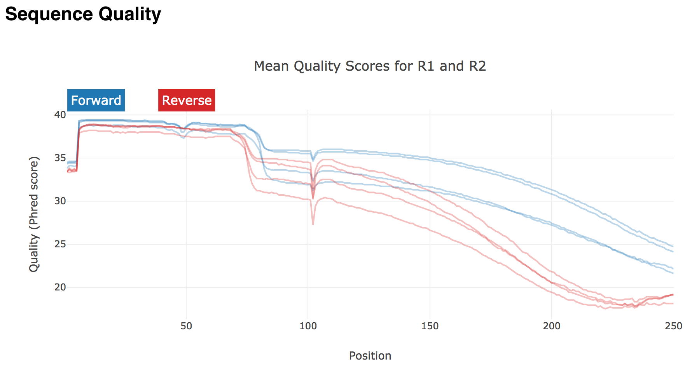
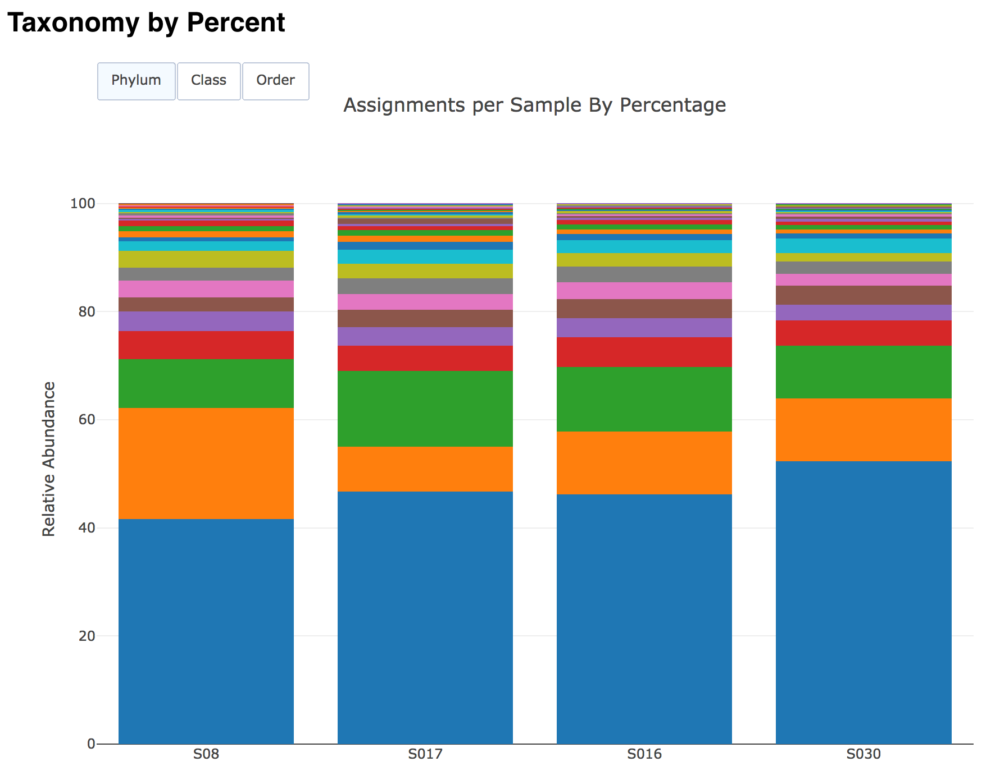

# PerSeq: Per sequence functional and taxonomic assignments

[](https://zenodo.org/badge/latestdoi/131617399)

PerSeq is an annotation workflow implemented in
[Snakemake](https://snakemake.readthedocs.io/en/stable/) and is designed to
be copied to your analysis directory. Dependencies are defined in
``envs/required.yaml`` and are installed at runtime via
[Bioconda](https://bioconda.github.io/)(``snakemake --use-conda``) or
[Biocontainers](https://biocontainers.pro/) (``snakemake --use-singularity``).

To report a bug or suggest changes, please use the
[GitHub repository](https://github.com/PNNL-CompBio/perseq).

# Installation

```
conda config --add channels defaults
conda config --add channels conda-forge
conda config --add channels bioconda
conda install python3 snakemake
```

Create your experimental working directory and clone the workflow:

```
mkdir soil-metag && cd $_
git clone https://github.com/PNNL-CompBio/perseq
cd perseq
```


# Usage

It is recommended that all file paths within the configuration have absolute
paths, that is, they all start with a slash. It is assumed `conda` is
available in your `$PATH` and that you want to use the environment defined
in the `perseq` workflow.

Edit the configuration file with your references then run `snakemake`:

```
snakemake --use-conda --jobs 8 --configfile config/config.yml
```

Results write into the current working directory, though an alternate may be
specified:

```
snakemake --directory results \
    --use-conda --jobs 8 --configfile config/config.yml
```


# Quality Control

Sequences are merged (step 01) using `bbmerge.sh` of BBTools. Merging allows
for read extensions up to 300 bp and will quality trim the sequences after
successfully merging R1 and R2. Merged sequences are then deduplicated
(step 02) using `clumpify.sh` of BBTools. Unique, merged sequences are then
mapped against contaminant libraries (step 03) in the form of key:value pairs
in the configuration. To filter against rRNA and PhiX, the specification looks
like:

```
contaminant_references:
    PhiX: resources/phix.fa
    rRNA: resources/rrna.fa.gz
```

Additional references are added to the list like:

```
contaminant_references:
    PhiX: resources/phix.fa
    rRNA: resources/rrna.fa.gz
    Ecoli: /local/path/ecoli.fa
```

Hits to contaminant references are detailed in
`quality_control/<sample>_03_<contaminant key>.fasta.gz`.

Counts for each stage and initial sequence quality are summarized in the HTML report:





# Taxonomic Annotation

Kmer-based taxonomic classification is performed on the merged reads using
Kaiju [5] in greedy mode (``-a greedy -E 0.05``) with the user supplied
reference index. To create a Kaiju reference of NCBI's nr database
containing reference sequences for archaea, bacteria, viruses, fungi, and
microbial eukaryotes execute `makeDB.sh -e` of Kaiju's executable library.

```
mkdir kaiju_db
cd kaiju_db
makeDB.sh -e -t {threads}
```

In the config, set `kaiju_db` as the absolute path to this directory:

```
kaijudb: /full/path/kaiju_db
```

Expected files after building the database are:

+ names.dmp
+ nodes.dmp
+ kaiju_db.fmi

To get a quick overview of the Kaiju assignments, `perseq` compiles absolute and relative abundance plots in the report:



# Functional Annotation

The blastx algorithm of DIAMOND is used to align nucleotide sequences to
a KEGG protein reference database consisting of non-redundant, family
level fungal eukaryotes and genus level prokaryotes
(``--strand=both --evalue 0.00001``). Due to KEGG's licensing, we cannot
distribute this reference database. The highest scoring alignment per
sequence is used for functional annotation.


# Updating References

To update the KO, pathway, and KEGG hierarchy reference data, execute:

```
./scripts/update_public_kegg_references.sh
```
